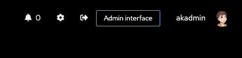
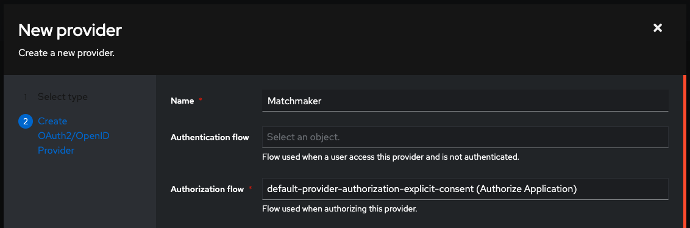
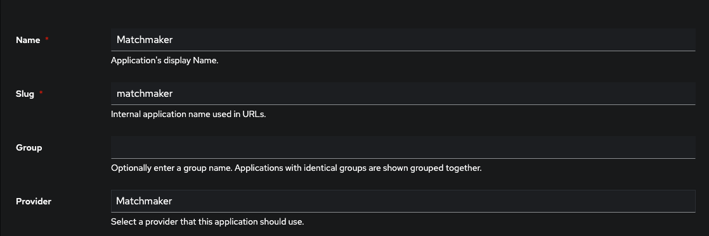

# Contributing

## Requirements

- Docker
- Node.js

## Setting up the development environment

1. Start the services

```bash
docker compose up -d
```

2. Copy `.env.example` to `.env`

3. Go to <https://authentik.localhost/if/flow/initial-setup/> and create admin account
4. Click on **Admin interface** button on the top right corner and login with the admin account
   

5. Go to `Applications > Providers` and create a new provider

6. Select **OAuth2/OpenID Provider** and click **Next**

7. Fill in the details and **Take note of the Client ID and Client secret!**
   

8. Set `OIDC_CLIENT_ID` and `OIDC_CLIENT_SECRET` in `.env` file

```bash
OIDC_CLIENT_ID=your_client_id
OIDC_CLIENT_SECRET=your_client_secret
```

8. Then go to `Applications > Applications` and create a new application (select the provider you created in the previous steps)
   

9. Set `PTERODACTYL_URL` to the root URL of your Pterodactyl instance

10. Set `PTERODACTYL_APP_API_KEY` to the application API key of your Pterodactyl instance (generated in the admin panel)
11. Set `PTERODACTYL_USER_API_KEY` to the user API key of your Pterodactyl instance (generated in the user panel)
12. Set `PTERODACTYL_USER_ID` to the same user id as the user API key
13. Set `PTERODACTYL_ALLOWED_NODES` to the node ids seperated with a comma (e.g. `1,2,3`) that the backend is allowed to use

14. Install the dependencies

```bash
npm run i
```

15. Generate the Prisma client

```bash
npm run prisma:generate
```

16. Push the database schema to the database

```bash
npm run prisma:push
```

17. Start the development server

```bash
npm run dev
```
